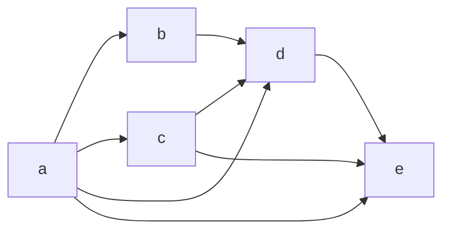
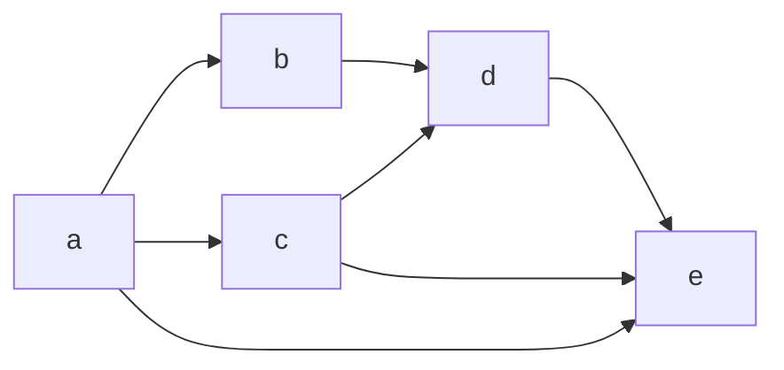

A header-only implementation of (approximate) transitive reduction

Input is assumed to be in lower triangular CSC format (see tests for some examples)
Output is given in the lower triangular CSC4 format

Idea is simple. Take the example from Wikipedia

In this graph, distance between `a` and `d` is 1. Consider the graph with the edge
between `a` and `d` removed

In this modified graph, distance between `a` and `d` is 2 (the important fact here
is that it is less than infinity) so there is a longer alternative path. Hence, we
can delete the edge between `a` and `d` without changing reachability.

That is the main idea in the `transitive_reduction` function, except that it is
adapted to CSC4 data structure.

To find the potential longer paths, we use DFS (though due to some implementation
tricks this degenerates to linear time longest path). We also truncate the search
at a depth. This leads to faster runtimes, but the final result is not necessarily
minimal anymore. However, the function itself is idempotent, e.g.
```
transitive_reduction(G) == transitive_reduction(transitive_reduction(G))
```
Furthermore, the graph returned by the function has the same reachability as the
original graph. Hence, this function can be used to sparsify the matrix.
